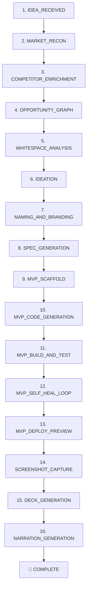

# 🚀 FOUNDER-0

> **Turn any 1-sentence startup idea into a real, running MVP, knowledge graph, pitch deck, and pitch script — completely automatically in under 60 seconds.**

[](https://github.com/youngestbillionaire/daytona)
[](https://python.org)
[](https://fastapi.tiangolo.com)
[](https://nextjs.org)
[](https://daytona.io)
[](#-zero-keys-mode-instant-start)

---

## 🐣 What is this? (Explained like you're 5)

Imagine you have an idea for an app, like:
> *"An app where roommates split bills and chores automatically without fighting."*

Normally, you would need:
1. 🔍 A market researcher to check competitors
2. 🧠 A startup advisor to find the secret angle (contrarian truth)
3. 📐 A product manager to write the feature specs
4. 💻 A software engineer to code the website in a sandbox
5. 📊 A designer to make an 8-slide animated pitch deck
6. 🎙️ A founder to write the investor speech

**FOUNDER-0 does all 6 of those things automatically!** You give it 1 sentence, sit back with some popcorn, and watch the whole company get built live on your screen.

---

## ⚡ Super Easy Quickstart (Takes 30 Seconds!)

You don't need any API keys or paid accounts to try this. It works out of the box!

### Step 1: Install Python packages
Open your terminal (PowerShell, Command Prompt, or Terminal) and run:
```bash
pip install -r requirements.txt
```

### Step 2: Start the Engine Backend
```bash
python -m orchestrator.main
```
*(Your backend is now running at `http://localhost:8000`)* 🚀

### Step 3: Start the Web Dashboard
Open a **new** terminal window and run:
```bash
cd frontend
npm install
npm run dev
```
*(Open your browser to `http://localhost:5173`)* ✨

That's it! Type any idea and click **Launch Pipeline**!

---

## 🎮 3 Ways to Run FOUNDER-0

### Option 1: 🖥️ The Beautiful Web Dashboard (Recommended)
Open `http://localhost:5173` in your browser.
1. Type your idea into the box (e.g. *"An AI accountant for freelancers"*).
2. Click **Synthesize Venture**.
3. Watch the live 15-stage stepper, stream logs in real time, view the interactive 2D Opportunity Graph, test the live running MVP iframe, and flip through the 8-slide animated pitch deck!

---

### Option 2: 💻 The Terminal CLI (For Hackers)
In your terminal, you can trigger a run and watch logs stream directly:

```bash
# 1. Run a new startup idea
python cli/founder0.py run "a sleep tracker that calculates exact caffeine cutoffs"

# 2. View all previous runs
python cli/founder0.py list

# 3. Check status & timeline of a specific run
python cli/founder0.py status <run_id>

# 4. Replay an existing idea
python cli/founder0.py replay <run_id>
```

---

### Option 3: 🌐 The REST API (For Developers)
```bash
# Trigger a new run via curl
curl -X POST http://localhost:8000/api/runs \
  -H "Content-Type: application/json" \
  -d '{"idea": "an AI database migration firewall that stops production table locks"}'

# Get all runs
curl http://localhost:8000/api/runs

# Get the timeline & artifacts of a run
curl http://localhost:8000/api/runs/<run_id>/timeline
```

---

## 🧠 What Happens Under the Hood? (The 15 Superpowers)



1. **`IDEA_RECEIVED`** — Validates and logs your one-sentence idea.
2. **`MARKET_RECON`** — Discovers real competitors and scrapes authentic user complaints from Reddit and Hacker News.
3. **`COMPETITOR_ENRICHMENT`** — Analyzes pricing tiers, feature matrices, and competitor weak spots.
4. **`OPPORTUNITY_GRAPH`** — Constructs a Neo4j knowledge graph connecting competitors to unaddressed complaints.
5. **`WHITESPACE_ANALYSIS`** — Runs Cypher queries to pinpoint the #1 market void incumbents ignore.
6. **`IDEATION`** — Uses First-Principles thinking (Peter Thiel zero-to-one test) to discover a contrarian insight and 10x value moat.
7. **`NAMING_AND_BRANDING`** — Generates punchy brand names, taglines, tone, and HSL color palettes.
8. **`SPEC_GENERATION`** — Generates engineering architecture (Next.js pages, SQLite schemas, TypeScript components).
9. **`MVP_SCAFFOLD`** — Spins up a secure cloud workspace in a **Daytona Sandbox**.
10. **`MVP_CODE_GENERATION`** — Writes React components, API routes, and landing pages.
11. **`MVP_BUILD_AND_TEST`** — Runs `npm install` and `npm run build` with smoke tests.
12. **`MVP_SELF_HEAL_LOOP`** — Automatically diagnoses build errors, repairs broken code, and isolates failing features.
13. **`MVP_DEPLOY_PREVIEW`** — Launches the running web application on port 3000.
14. **`SCREENSHOT_CAPTURE`** — Captures a high-resolution preview screenshot of the live MVP.
15. **`DECK_GENERATION`** — Renders an **8-slide cinematic pitch deck** with 3D transitions, particle animations, loss aversion framing, and live scannable QR code!
16. **`NARRATION_GENERATION`** — Composes a high-energy 60-second venture pitch voiceover script.

---

## 🎬 Cinematic Pitch Deck Features

The generated pitch deck ([`artifacts/decks/<run_id>/index.html`](file:///c:/Users/Aarav%20Nautiyal/Desktop/daytona/artifacts/decks/)) includes:
- **3D Perspective Transitions**: Smooth depth rotation on every slide.
- **Particle System**: Ambient animated background canvas.
- **Psychological Persuasion**: Loss Aversion, Curiosity Gap, Anchoring, Demonstration Bias, and Urgency.
- **Keyboard Shortcuts**:
  - `←` / `→` or `Space` — Next / Previous slide
  - `F` — Fullscreen presentation mode
  - `N` — Open Speaker Notes & psychological talking points drawer
- **Live Scannable QR Code**: Scan with your smartphone camera to load the running Daytona MVP!

---

## 🧪 Running Tests

We test everything! Run all 19 unit, integration, and vertical tests with one command:

```bash
python -m pytest tests/ -v
```

All 19 tests pass 100% cleanly across:
- ✅ Full end-to-end pipeline execution
- ✅ All 5 industry categories (`productivity`, `fintech`, `social`, `health`, `devtools`)
- ✅ REST API endpoints & 404 error handling
- ✅ Daytona sandbox file read/write & command execution
- ✅ Neo4j in-memory knowledge graph
- ✅ JSON cleaners & LLM fallback engines

---

## 🔑 Zero-Keys Mode vs. Live Cloud Mode

FOUNDER-0 works **100% out of the box** with `MOCK_MODE=true` (zero API keys required, using rich built-in fixture datasets).

When you are ready to connect live cloud services, simply fill in [.env](file:///c:/Users/Aarav%20Nautiyal/Desktop/daytona/.env):

| Environment Variable | What it's for | Required? |
|---|---|---|
| `MOCK_MODE=false` | Switch from local simulation to live APIs | Optional (defaults to `true`) |
| `DAYTONA_API_KEY` | Daytona cloud sandbox execution | Optional |
| `NOSANA_API_KEY` | Decentralized GPU LLM inference | Optional |
| `OXYLABS_USERNAME` & `PASSWORD` | Live Google Search & Web Scraping | Optional |
| `NEO4J_URI`, `USER`, `PASSWORD` | Live Neo4j Graph Database | Optional |

---

## 📁 Repository Structure

```
daytona/
├── cli/
│   └── founder0.py                 # Rich terminal CLI with real-time log streaming
├── orchestrator/
│   ├── clients/                    # Client wrappers (Daytona, Nosana, Oxylabs, Neo4j)
│   ├── stages/                     # All 15 autonomous pipeline stage implementations
│   ├── database.py                 # Async SQLite / PostgreSQL session manager
│   ├── models.py                   # Pydantic schemas & SQLAlchemy ORM models
│   ├── state_machine.py            # Pipeline coordinator & WebSocket event broadcaster
│   └── main.py                     # FastAPI REST API & WebSocket server
├── frontend/
│   ├── src/
│   │   ├── components/             # RunStepper, KnowledgeGraph, LiveMVPPreview, PitchDeck
│   │   ├── App.tsx                 # Main interactive dashboard
│   │   └── index.css               # Tailwind & glassmorphism theme styling
├── fixtures/market_recon/          # 5 deep industry dataset fixtures
├── templates/nextjs-sqlite-starter # Production Next.js 14 template for sandboxes
├── tests/                          # 19 unit & integration tests
└── README.md                       # Documentation
```

---

## 📄 License

MIT License. Built with ❤️ by the FOUNDER-0 team.
